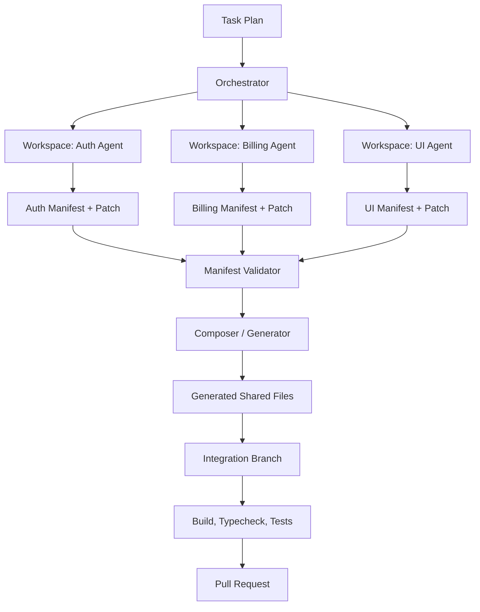

# Agent Orchestrator: Conflict Prevention for Multi-Agent Coding Workflows

**Document type:** Product and technical implementation plan  
**Working name:** Agent Orchestrator  
**Core promise:** Generate a safe multi-agent plan, run agents in isolated workspaces, prevent forbidden edits, and compose accepted outputs into a clean integration result.  
**Status:** Final MVP specification  
**Date:** 2026-06-29

---

## 1. Executive Summary

AI coding agents are becoming active software contributors. Tools such as GitHub Copilot cloud agent, Cursor cloud agents, Claude Code, and similar systems allow developers to delegate larger coding tasks that run outside the immediate editor session. The next bottleneck is not whether one agent can complete one task. The bottleneck is whether teams can safely run many agents at the same time.

The product described in this document is a **conflict-preventing orchestration layer for multi-agent software development**.

The key insight is simple:

> Do not let multiple agents edit the same mutable codebase directly. Give every agent an isolated workspace, force it to emit structured outputs, and let a deterministic orchestrator compose the final repository state.

This turns multi-agent development from a branch-merging problem into a controlled composition problem.

Instead of allowing agents to race against each other in the same repository, the system enforces:

- hard ownership boundaries;
- isolated workspaces;
- read-only shared contracts;
- declarative manifests;
- generated shared files;
- deterministic composition;
- contract-change request workflows;
- integration gates before PR creation.

The target user is not a casual solo developer using one AI assistant at a time. The target user is an AI-heavy engineering team, founder-led product team, agency, platform team, or open-source maintainer who wants to run multiple coding agents in parallel without creating integration chaos.

---

## 2. One-Sentence Pitch

**Agent Orchestrator lets engineering teams run many coding agents in parallel by preventing overlapping edits before they happen.**

Alternative positioning:

- **Parallelize AI coding without branch chaos.**
- **A coordination layer for multi-agent software development.**
- **Give every coding agent a safe lane.**
- **Run five agents at once without them stepping on each other.**

---

## 3. Why This Should Exist

### 3.1 The Current Shift

AI coding tools are moving from autocomplete toward autonomous coding agents.

GitHub Copilot cloud agent can research a repository, create an implementation plan, make code changes on a branch, and let the user review the diff and create a pull request when ready.[^github-cloud-agent] GitHub also documents Copilot sessions that run in the background, with some entry points opening pull requests automatically or allowing users to create PRs when the work is complete.[^github-copilot-sessions]

Cursor also documents cloud agents for continuous coding assistance.[^cursor-cloud-agent] Anthropic's Claude Code ecosystem includes GitHub Actions integration that can respond to issues and pull requests and implement code changes.[^claude-code-action]

This means more developers will soon delegate multiple concurrent tasks to multiple agents.

### 3.2 The Problem

Traditional Git workflows assume human contributors coordinate through branches, reviews, and CI.

Multi-agent workflows increase the number of simultaneous contributors, but those contributors often lack the same shared context, social awareness, or architectural judgment as a human team.

Common failure modes include:

- two agents editing the same file;
- two agents changing the same abstraction in different ways;
- one agent renaming a function while another depends on the old name;
- multiple agents appending to the same route registry, plugin registry, config file, or index file;
- duplicate IDs, duplicated routes, duplicated permissions, or duplicated migration names;
- agents generating tests that assume incompatible behavior;
- parallel branches that all pass locally but fail when integrated;
- PR queues filled with agent-generated work that is hard to merge safely.

A recent AgenticFlict preprint analyzed a large dataset of AI coding agent pull requests. It reports 142K+ agentic PRs, 107K+ successfully processed through deterministic merge simulation, and 29K+ PRs exhibiting merge conflicts, for a reported conflict rate of 27.67% in that dataset.[^agenticflict]

Even when there is no textual Git conflict, semantic conflicts remain possible.

Example:

```text
auth-agent edits src/auth/session.ts
api-agent edits src/api/users.ts
tests-agent edits src/api/users.test.ts
```

Git may merge these files cleanly, but the result can still be broken if `auth-agent` changes the session shape while `api-agent` still expects the old version.

### 3.3 Why Existing Tools Are Not Enough

Git can detect some textual conflicts. CI can detect some build and test failures. Code review can detect some semantic issues.

But those tools are mostly reactive.

They answer:

> Did this break after the fact?

The proposed system answers:

> How do we structure agent work so these conflicts are prevented in the first place?

This product is not primarily a conflict detector. It is a **coordination protocol and enforcement layer**.

---

## 4. Product Thesis

The system should enforce the following rule:

> Agents do not edit shared state. Agents emit isolated artifacts. The orchestrator composes those artifacts into the final repository.

This is the difference between a risky workflow and a safe workflow.

Risky workflow:

```text
Agent A ─┐
Agent B ─┼── all edit /project/src directly
Agent C ─┘
```

Safer workflow:

```text
Agent A ── writes /workspaces/agent-a/output
Agent B ── writes /workspaces/agent-b/output
Agent C ── writes /workspaces/agent-c/output

Orchestrator ── validates manifests, composes generated files, opens PR
```

The orchestrator owns shared files. Agents own only their assigned modules.

---

## 5. Target Users

### 5.1 Primary Users

The best initial users are teams already pushing AI coding tools hard:

1. **Small AI-heavy engineering teams**  
   Teams of 2–20 engineers trying to ship faster with multiple coding agents.

2. **Founder-led product teams**  
   Founders who delegate many tasks to agents and need a way to avoid branch chaos.

3. **Agencies and product studios**  
   Teams building multiple features, landing pages, integrations, and internal tools in parallel.

4. **Enterprise platform teams**  
   Teams experimenting with agentic coding but needing governance, permissions, and auditability.

5. **Open-source maintainers**  
   Maintainers receiving or generating many AI-assisted pull requests.

6. **AI coding power users**  
   Developers using several tools at once, such as Cursor, Claude Code, Copilot, Codex-like agents, or custom internal agents.

### 5.2 Poor Initial Users

The product is less useful for:

- solo developers using one coding agent at a time;
- teams using AI only for autocomplete;
- teams that do not trust agent-generated code at all;
- teams unwilling to adopt repository conventions;
- teams with highly tangled legacy codebases where ownership boundaries cannot be defined.

---

## 6. Core Product Concept

### 6.1 The System in One Diagram



### 6.2 The Main Rule

Agents may write only inside their assigned workspace or owned module.

They may read:

- repository source;
- contracts;
- schemas;
- documentation;
- task descriptions;
- architecture notes.

They may not directly edit:

- shared registries;
- central route files;
- global config;
- index barrels;
- dependency injection containers;
- shared contracts;
- generated files;
- another agent's owned area.

### 6.3 The Key Abstraction: Agent Output Manifests

Each agent outputs code plus a manifest describing what it contributes.

Example:

```json
{
  "agent": "billing-agent",
  "feature": "billing",
  "exports": [
    {
      "symbol": "BillingPage",
      "from": "./BillingPage"
    }
  ],
  "routes": [
    {
      "id": "billing.route.invoices",
      "path": "/billing/invoices",
      "component": "BillingPage",
      "priority": 40
    }
  ],
  "permissions": [
    {
      "id": "billing.permission.read",
      "name": "billing:read"
    }
  ],
  "contractChangeRequests": []
}
```

The orchestrator validates this manifest, rejects duplicates, and generates shared files from all accepted manifests.


### 6.4 Planning Layer: Product-Generated YAML Plans

The product should not require users to hand-write YAML in the normal path.

The preferred user experience is:

```bash
paraflow plan "Add password reset, invoice downloads, and dashboard summary cards"
```

The product then:

1. scans the repository structure;
2. detects modules, packages, test folders, shared files, and likely ownership boundaries;
3. decomposes the user's goal into safe workstreams;
4. decides how many agents to propose;
5. generates a reviewable `task-plan.yml`;
6. asks the user to approve or edit before running.

The generated YAML is not hidden magic. It is an explicit review artifact.

Example generated plan:

```yaml
version: 1
runId: "password-reset-invoices-dashboard"
baseBranch: "main"

verify:
  - "pnpm lint"
  - "pnpm typecheck"
  - "pnpm test"

protected:
  - "src/generated/**"
  - "contracts/**"
  - "package.json"
  - "pnpm-lock.yaml"

agents:
  auth:
    adapter: "claude-code"
    task: "Implement password reset flow, including request form, reset token handling, and tests."
    owns:
      - "src/features/auth/**"
      - "tests/features/auth/**"
    mayRead:
      - "src/core/**"
      - "contracts/**"
    forbidden:
      - "src/generated/**"
      - "src/features/billing/**"
      - "src/features/dashboard/**"
      - "package.json"
      - "pnpm-lock.yaml"

  billing:
    adapter: "claude-code"
    task: "Add invoice PDF download page and related tests."
    owns:
      - "src/features/billing/**"
      - "tests/features/billing/**"
    mayRead:
      - "src/core/**"
      - "contracts/**"
    forbidden:
      - "src/generated/**"
      - "src/features/auth/**"
      - "src/features/dashboard/**"
      - "package.json"
      - "pnpm-lock.yaml"

  dashboard:
    adapter: "claude-code"
    task: "Add dashboard summary cards using existing data contracts."
    owns:
      - "src/features/dashboard/**"
      - "tests/features/dashboard/**"
    mayRead:
      - "src/core/**"
      - "contracts/**"
    forbidden:
      - "src/generated/**"
      - "src/features/auth/**"
      - "src/features/billing/**"
      - "package.json"
      - "pnpm-lock.yaml"
```

The product should generate conservative plans. When unsure, it should protect files instead of granting broad write access.

Bad generated scope:

```yaml
agents:
  agent1:
    owns:
      - "src/**"
```

Better generated scope:

```yaml
agents:
  auth:
    owns:
      - "src/features/auth/**"
      - "tests/features/auth/**"
```

The planning layer is a major part of the product. The user should feel like they are describing a goal, not configuring infrastructure.

### 6.5 Agent Count Decision Model

The product should decide how many agents to propose, but it should do so as a reviewable recommendation.

The user flow is:

```text
User gives goal
↓
Product analyzes repo
↓
Product decomposes work
↓
Product proposes N agents
↓
User approves or edits
↓
Product launches agents
```

The product should create multiple agents only when the work is safely separable.

Good reasons to create separate agents:

- different feature folders;
- different domain concepts;
- independent test areas;
- no shared contract change;
- no shared migration;
- no package dependency change;
- no required sequential dependency.

Bad reasons to create separate agents:

- all tasks touch the same files;
- all tasks require one shared contract change;
- tasks are sequentially dependent;
- tasks affect the same database table or migration;
- tasks all require package manager changes.

Examples:

```text
Goal:
Add password reset, billing invoice export, and dashboard cards.

Decision:
Create 3 agents because auth, billing, and dashboard map to separate modules.
```

```text
Goal:
Refactor UserSession and update every usage.

Decision:
Create 1 contract/refactor agent because the change is cross-cutting.
```

```text
Goal:
Add team permissions and use them in billing and dashboard.

Decision:
Create phases.

Phase 1:
- permissions-contract-agent updates the shared contract.

Phase 2:
- billing-agent consumes the new contract.
- dashboard-agent consumes the new contract.
```

The strongest version of the product is therefore not just an agent runner. It is a planner and orchestrator that decides:

- how many agents to create;
- what each agent owns;
- what each agent may read;
- what each agent must not touch;
- which work can run in parallel;
- which work must run sequentially;
- how outputs get composed.

---

## 7. What “Conflict Prevention” Means

Conflict prevention does not mean the system can guarantee that no human will ever need to make a design decision.

It means the system prevents the most common avoidable failure modes by construction.

### 7.1 Prevented by File Isolation

- Two agents cannot edit the same file.
- One agent cannot overwrite another agent's code.
- Agents cannot directly mutate central files.
- Shared generated files are not hand-edited.

### 7.2 Prevented by Ownership Rules

- Two agents cannot claim the same domain concept.
- Two agents cannot define the same route ID.
- Two agents cannot register the same permission.
- Two agents cannot create the same migration name.
- Agents cannot alter contracts they do not own.

### 7.3 Prevented by Manifest Validation

- Duplicate identifiers are rejected.
- Invalid schema outputs are rejected.
- Missing required declarations are rejected.
- Disallowed dependencies are rejected.
- Cross-domain writes are rejected.

### 7.4 Not Fully Preventable

Some conflicts require design judgment:

- two features that are logically incompatible;
- a product requirement that contradicts another requirement;
- a contract change that requires a coordinated migration;
- behavior that passes tests but is undesirable;
- performance regressions or UX inconsistencies.

For these, the system should surface a structured escalation rather than pretending everything is automatable.

---

## 8. Design Principles

### Principle 1: No Shared Mutable Files

If multiple agents need to update the same file, that file should probably be generated.

Common generated files:

```text
src/generated/routes.ts
src/generated/navigation.ts
src/generated/permissions.ts
src/generated/plugin-registry.ts
src/generated/schema-registry.ts
src/generated/env.ts
src/generated/index.ts
```

Agents produce fragments. The orchestrator produces the final shared file.

### Principle 2: One Writer Per Domain Concept

Ownership should apply to concepts, not only files.

Example:

```yaml
domains:
  auth:
    owner: auth-agent
    concepts:
      - User
      - Session
      - Login
      - PasswordReset
      - PermissionCheck

  billing:
    owner: billing-agent
    concepts:
      - Invoice
      - Subscription
      - PaymentMethod
      - BillingPortal
```

This prevents two agents from implementing competing versions of the same abstraction.

### Principle 3: Contracts Are Read-Only During Normal Agent Runs

Agents can consume contracts but cannot modify them.

If an agent needs a contract change, it emits a request:

```json
{
  "type": "contract_change_request",
  "contract": "UserSession",
  "requestedChange": "Add expiresAt field",
  "reason": "Billing needs to know whether the current session is stale.",
  "impact": [
    "src/features/billing",
    "src/features/auth",
    "src/api"
  ]
}
```

The orchestrator then schedules a separate contract-update phase or escalates to a human.

### Principle 4: Composition Must Be Deterministic

Given the same agent outputs, the orchestrator should always produce the same result.

Rules:

- sort routes by priority, then path, then ID;
- sort permissions by ID;
- sort exports by package name and symbol;
- reject duplicate IDs;
- reject unstable generated output;
- fail if generation changes without manifest changes.

### Principle 5: Agents Emit Declarations, Not Mutations

Prefer declarative output:

```json
{
  "routes": [
    {
      "id": "auth.route.login",
      "path": "/login",
      "component": "LoginPage"
    }
  ]
}
```

Avoid imperative mutation:

```ts
router.add("/login", LoginPage)
```

The orchestrator should own mutation and registration.

### Principle 6: The Repository Should Be Agent-Friendly

The repository should be structured so agent work naturally falls into safe boundaries.

Example:

```text
src/
  features/
    auth/
    billing/
    reporting/
  contracts/
  generated/
  core/
  tests/
```

Agents can own feature directories. The core and contracts remain protected.

---

## 9. Repository Layout

A recommended repository structure:

```text
repo/
  .agent-orchestrator/
    task-plan.yml
    ownership.yml
    manifest.schema.json
    generators/
      routes.generator.ts
      permissions.generator.ts
      navigation.generator.ts

  contracts/
    user-session.schema.ts
    permissions.schema.ts
    plugin.schema.ts

  src/
    core/
      app.ts
      router.ts
      plugin-loader.ts

    features/
      auth/
      billing/
      reporting/

    generated/
      routes.ts
      permissions.ts
      navigation.ts
      plugin-registry.ts

  workspaces/
    auth-agent/
      output/
        manifest.json
        patch.diff
        notes.md

    billing-agent/
      output/
        manifest.json
        patch.diff
        notes.md
```

Generated files should carry a header:

```ts
// AUTO-GENERATED BY Agent Orchestrator.
// DO NOT EDIT BY HAND.
// Source: .agent-orchestrator/manifests/**
```


## 9.1 Repository Modification Policy

The product should be non-invasive by default.

For the MVP, the product should not move, rename, or restructure the user's source files automatically. It should add only its own metadata and run artifacts.

Default MVP additions:

```text
.paraflow/
  task-plan.yml
  ownership.yml
  runs/
  reports/
```

The user's existing repository layout remains unchanged.

Example existing repo:

```text
src/
  auth/
  billing/
  dashboard/
  routes.ts
  package.json
```

The generated ownership model can protect shared files without moving them:

```yaml
auth-agent:
  owns:
    - "src/auth/**"

billing-agent:
  owns:
    - "src/billing/**"

protected:
  - "src/routes.ts"
  - "package.json"
```

This makes adoption easier because users can try the product without agreeing to a large refactor.

## 9.2 Optional Generated-File Mode

The stronger version of the product can propose generated shared files, but this should require explicit user approval.

Example problem:

```text
auth-agent wants to add /login
billing-agent wants to add /billing/invoices
dashboard-agent wants to add /dashboard
```

Without orchestration, all three may edit:

```text
src/routes.ts
```

The product can propose:

```text
I detected that multiple agents may need to edit src/routes.ts.

Recommended:
Convert src/routes.ts into an orchestrator-generated file.

This will create or use:
- src/features/auth/routes.ts
- src/features/billing/routes.ts
- src/features/dashboard/routes.ts
- src/generated/routes.ts

Proceed? [Y/n]
```

In generated-file mode, agents edit their own route fragments:

```text
src/features/auth/routes.ts
src/features/billing/routes.ts
src/features/dashboard/routes.ts
```

The orchestrator generates the shared file:

```text
src/generated/routes.ts
```

The product should never silently move source files around.

Recommended policy:

```text
MVP:
Existing repo structure stays unchanged.

Advanced mode:
Product suggests safer layout and generated shared files.

Never:
Silently move, rename, or restructure user files.
```

## 9.3 What the Orchestrator Owns

The orchestrator is responsible for coordination and composition, not for randomly rearranging the project.

In the MVP, the orchestrator owns:

- `.paraflow/**`;
- isolated run directories;
- task plans;
- ownership maps;
- generated reports;
- generated shared files only when the user has explicitly enabled generated-file mode.

The orchestrator does not own:

- normal source files;
- human-written feature code;
- contracts unless a contract-agent phase is explicitly approved;
- package manager files unless dependency orchestration is explicitly enabled.

This ownership distinction is important for trust. The user should always know what the product can and cannot modify.

---

## 10. Example Workflow

### 10.1 Human Creates Task Plan

```yaml
runId: "2026-06-29-password-reset-and-billing"
baseBranch: "main"

agents:
  auth:
    model: "claude-code"
    task: "Implement password reset flow."
    owns:
      - "src/features/auth/**"
      - "tests/features/auth/**"
    mayRead:
      - "contracts/**"
      - "src/core/**"
    outputs:
      - "routes"
      - "permissions"
      - "emails"
    forbidden:
      - "src/generated/**"
      - "contracts/**"

  billing:
    model: "copilot-agent"
    task: "Add invoice PDF download page."
    owns:
      - "src/features/billing/**"
      - "tests/features/billing/**"
    mayRead:
      - "contracts/**"
      - "src/core/**"
    outputs:
      - "routes"
      - "permissions"
      - "navigation"
    forbidden:
      - "src/generated/**"
      - "contracts/**"
```

### 10.2 Orchestrator Creates Isolated Workspaces

```bash
paraflow run .agent-orchestrator/task-plan.yml
```

Internally:

```bash
git worktree add .paraflow/worktrees/auth-agent main
git worktree add .paraflow/worktrees/billing-agent main
```

Each workspace has write permissions only for its owned paths.

### 10.3 Agents Produce Outputs

Example output:

```text
.paraflow/worktrees/auth-agent/
  src/features/auth/password-reset.ts
  tests/features/auth/password-reset.test.ts
  agent-output/manifest.json
  agent-output/notes.md
```

### 10.4 Orchestrator Validates

Checks:

- all changed files match allowed globs;
- no forbidden files changed;
- manifest matches JSON Schema;
- IDs are globally unique;
- generated shared files are not manually edited;
- dependencies obey allowed boundaries;
- contract changes are represented as requests, not direct edits.

### 10.5 Orchestrator Composes

```bash
paraflow compose
```

Generated result:

```ts
// src/generated/routes.ts
import { authRoutes } from "../features/auth/routes"
import { billingRoutes } from "../features/billing/routes"

export const routes = [
  ...authRoutes,
  ...billingRoutes
]
```

### 10.6 Orchestrator Verifies

```bash
pnpm lint
pnpm typecheck
pnpm test
pnpm build
```

### 10.7 Orchestrator Opens PR

```bash
paraflow pr
```

PR description includes:

- tasks assigned;
- agents used;
- files changed by each agent;
- generated files;
- contract-change requests;
- validation report;
- test results;
- known risks.

---

## 11. Core Components

### 11.1 Orchestrator CLI

The CLI is the first product surface.

Suggested commands:

```bash
paraflow init
paraflow plan create
paraflow run task-plan.yml
paraflow status
paraflow compose
paraflow verify
paraflow report
paraflow pr
```

Responsibilities:

- parse task plan;
- create workspaces;
- enforce ownership;
- invoke configured agents;
- collect outputs;
- validate manifests;
- compose generated files;
- run checks;
- publish reports.

### 11.2 Ownership Engine

The ownership engine determines which paths and concepts each agent controls.

Input:

```yaml
agents:
  auth:
    owns:
      - "src/features/auth/**"
    mayRead:
      - "contracts/**"
      - "src/core/**"
    forbidden:
      - "src/generated/**"
      - "src/features/billing/**"
```

Validation:

- changed files must be within `owns`;
- forbidden files cannot be changed;
- generated files cannot be edited;
- ownership globs cannot overlap unless explicitly allowed;
- concept ownership cannot overlap.

### 11.3 Workspace Manager

The workspace manager creates isolated work environments.

Implementation options:

1. **Git worktrees**  
   Easiest MVP. Each agent receives a worktree from the same base branch.

2. **Docker sandbox with read-only bind mounts**  
   Stronger write prevention. Mount most of the repository read-only, and mount owned directories as writable.

3. **Overlay filesystem**  
   Useful for advanced isolation and capturing writes.

4. **Patch-level enforcement**  
   The simplest enforcement: allow the agent to run freely, but reject any patch touching forbidden files. This is prevention at the integration boundary, not at execution time. It is acceptable for an MVP but weaker than sandboxing.

Best MVP path:

- start with Git worktrees;
- validate diffs after the agent run;
- add Docker-based write guards in v2.

### 11.4 Agent Adapter Layer

The orchestrator should not be tied to a single coding agent.

Adapter interface:

```ts
export interface AgentAdapter {
  name: string
  prepare(context: AgentContext): Promise<void>
  run(task: AgentTask): Promise<AgentRunResult>
  collectOutput(workspacePath: string): Promise<AgentOutput>
}
```

Initial adapters:

- generic shell command;
- Claude Code CLI;
- GitHub Copilot agent workflow;
- Cursor background/cloud agent handoff;
- custom internal agent command.

Example config:

```yaml
agentAdapters:
  claude-code:
    command: "claude-code run --task {{taskFile}}"
  generic:
    command: "{{command}}"
```

### 11.5 Manifest Validator

Each agent must output a manifest.

Manifest schema responsibilities:

- ensure required fields exist;
- validate route IDs;
- validate permission IDs;
- validate exports;
- validate generated artifacts;
- validate contract-change requests;
- reject unknown output types unless explicitly allowed.

Example schema concepts:

```json
{
  "agent": "string",
  "feature": "string",
  "routes": "RouteDefinition[]",
  "permissions": "PermissionDefinition[]",
  "exports": "ExportDefinition[]",
  "contractChangeRequests": "ContractChangeRequest[]"
}
```

### 11.6 Composer / Generator

The composer reads all accepted manifests and generates shared files.

Generators should be pluggable.

Example generator config:

```yaml
generators:
  routes:
    input: "routes"
    output: "src/generated/routes.ts"
    sortBy:
      - "priority"
      - "path"
      - "id"

  permissions:
    input: "permissions"
    output: "src/generated/permissions.ts"
    sortBy:
      - "id"
```

Generators should fail on:

- duplicate IDs;
- missing referenced symbols;
- invalid import paths;
- unstable sort order;
- invalid output.

### 11.7 Contract Registry

Contracts define shared interfaces.

Examples:

```text
contracts/
  AppPlugin.ts
  RouteDefinition.ts
  PermissionDefinition.ts
  UserSession.ts
```

Contract policy:

- normal agents can read contracts;
- normal agents cannot edit contracts;
- contract-agent or human can edit contracts;
- contract changes should be separate tasks;
- downstream tasks should run after contract updates.

### 11.8 Integration Verifier

The verifier runs normal project checks.

Suggested default checks:

```bash
pnpm format:check
pnpm lint
pnpm typecheck
pnpm test
pnpm build
```

For larger teams:

- database migration dry-run;
- API schema diff;
- OpenAPI validation;
- contract tests;
- visual regression;
- package boundary checks;
- dependency graph checks.

### 11.9 PR Publisher

The PR publisher creates a clear review artifact.

PR title:

```text
[paraflow] Compose password reset and billing invoice tasks
```

PR body:

```markdown
## Summary

This PR composes outputs from 2 agent workspaces.

## Agents

| Agent | Task | Owned Paths | Status |
|---|---|---|---|
| auth | Implement password reset | src/features/auth/** | Passed |
| billing | Add invoice download page | src/features/billing/** | Passed |

## Generated Files

- src/generated/routes.ts
- src/generated/permissions.ts
- src/generated/navigation.ts

## Validation

- Ownership: passed
- Manifest schema: passed
- Duplicate IDs: passed
- Typecheck: passed
- Tests: passed

## Contract Change Requests

None.
```

---

## 12. MVP Scope

### 12.1 MVP Goal

Build a CLI that lets a team run two or more agents in isolated workspaces and compose their outputs without direct shared-file edits.

### 12.2 MVP Must-Haves

1. **Task plan file**

```yaml
agents:
  auth:
    task: "Implement password reset."
    owns:
      - "src/features/auth/**"
```

2. **Workspace creation**

Use Git worktrees.

3. **Diff validation**

Reject agent output if changed files fall outside ownership.

4. **Manifest schema**

Require `manifest.json`.

5. **Generated shared file support**

Start with route registry or plugin registry.

6. **Duplicate ID prevention**

Reject duplicate route IDs, plugin IDs, permission IDs.

7. **Verification command**

Run configured commands.

8. **Markdown report**

Produce `paraflow-report.md`.

### 12.3 MVP Nice-to-Haves

- Docker sandboxing;
- GitHub PR creation;
- dashboard UI;
- contract-change request flow;
- codeowner integration;
- semantic dependency analysis;
- IDE extension.

### 12.4 MVP Non-Goals

Do not attempt to solve everything at first.

Avoid in MVP:

- full semantic merge resolution;
- irreversible automatic repository restructuring;
- complex multi-repo orchestration;
- enterprise policy UI;
- arbitrary language support;
- deep AST analysis for every stack;
- fully autonomous changes without user review and approval.


## 12.5 Final MVP Definition

The final MVP should be a local-first CLI that generates safe multi-agent plans, lets the user approve them, runs agents in isolated workspaces, prevents forbidden edits, and produces a clean integration report.

The MVP should be intentionally non-invasive.

It should not require the user to restructure their repository.

### Final MVP Promise

```text
Describe a goal.
Get a safe multi-agent plan.
Approve it.
Run agents in isolated workspaces.
Block unsafe edits.
Compose accepted outputs.
Get one clean report or PR.
```

### Final MVP Commands

```bash
paraflow init
paraflow analyze
paraflow plan "Add password reset, invoice downloads, and dashboard summary cards"
paraflow plan review
paraflow run
paraflow status
paraflow compose
paraflow verify
paraflow report
```

Optional later command:

```bash
paraflow pr
```

### Final MVP User Flow

```text
1. User installs CLI.
2. User runs paraflow init.
3. Product scans repo and identifies likely modules, tests, shared files, generated files, package files, and contracts.
4. User describes a development goal.
5. Product proposes a task plan with N agents.
6. User reviews and approves the plan.
7. Product creates isolated Git worktrees.
8. Each agent runs only against its assigned task and ownership scope.
9. Product rejects patches that touch forbidden files.
10. Product collects manifests and notes from accepted agents.
11. Product optionally generates shared files if enabled.
12. Product runs lint, typecheck, tests, and build.
13. Product creates a Markdown report.
14. User manually reviews or opens a PR.
```

### Final MVP Product Boundaries

MVP should do:

- generate `task-plan.yml`;
- decide the proposed number of agents;
- let user approve or edit the plan;
- create Git worktree isolation;
- enforce ownership by validating changed files;
- reject forbidden edits;
- protect package files, contracts, generated files, and shared files by default;
- support a generic shell adapter for any coding agent;
- generate a Markdown report;
- support TypeScript repositories first.

MVP should not do yet:

- silently move files;
- automatically restructure repositories;
- require generated-file architecture;
- deeply understand every programming language;
- fully automate semantic conflict resolution;
- become a full SaaS dashboard;
- manage production credentials;
- make irreversible repository changes.

### Final MVP Trust Rule

The product should never silently make structural changes.

Any action that changes repository architecture should be proposed, explained, and approved.

Examples requiring approval:

- converting `src/routes.ts` to generated-file mode;
- moving route declarations into feature modules;
- creating a new `src/generated/**` directory;
- allowing an agent to edit `contracts/**`;
- allowing dependency changes to `package.json`;
- creating a contract-agent phase.

### Final MVP Generated Plan Example

```yaml
version: 1
runId: "password-reset-invoices-dashboard"
baseBranch: "main"

verify:
  - "pnpm lint"
  - "pnpm typecheck"
  - "pnpm test"

protected:
  - "src/generated/**"
  - "contracts/**"
  - "package.json"
  - "pnpm-lock.yaml"

agents:
  auth:
    adapter: "generic"
    command: "claude-code run --task .paraflow/runs/current/agents/auth/task.md"
    task: "Implement password reset flow."
    owns:
      - "src/features/auth/**"
      - "tests/features/auth/**"
    mayRead:
      - "src/core/**"
      - "contracts/**"
    forbidden:
      - "src/generated/**"
      - "src/features/billing/**"
      - "src/features/dashboard/**"
      - "package.json"
      - "pnpm-lock.yaml"

  billing:
    adapter: "generic"
    command: "claude-code run --task .paraflow/runs/current/agents/billing/task.md"
    task: "Add invoice PDF download page."
    owns:
      - "src/features/billing/**"
      - "tests/features/billing/**"
    mayRead:
      - "src/core/**"
      - "contracts/**"
    forbidden:
      - "src/generated/**"
      - "src/features/auth/**"
      - "src/features/dashboard/**"
      - "package.json"
      - "pnpm-lock.yaml"

  dashboard:
    adapter: "generic"
    command: "claude-code run --task .paraflow/runs/current/agents/dashboard/task.md"
    task: "Add dashboard summary cards."
    owns:
      - "src/features/dashboard/**"
      - "tests/features/dashboard/**"
    mayRead:
      - "src/core/**"
      - "contracts/**"
    forbidden:
      - "src/generated/**"
      - "src/features/auth/**"
      - "src/features/billing/**"
      - "package.json"
      - "pnpm-lock.yaml"
```

### Final MVP Report Example

```markdown
# Paraflow Run Report

Run: password-reset-invoices-dashboard

## Plan

The product proposed 3 agents because the requested work mapped to 3 independent feature areas:
- auth
- billing
- dashboard

## Agent Results

| Agent | Task | Status | Reason |
|---|---|---|---|
| auth | Implement password reset | Accepted | Changed only owned files |
| billing | Add invoice download page | Accepted | Changed only owned files |
| dashboard | Add dashboard cards | Rejected | Attempted to edit src/generated/navigation.ts |

## Prevented Issues

- dashboard-agent attempted to edit an orchestrator-owned generated file.
- Edit was rejected before integration.

## Verification

- Ownership checks: passed for accepted agents
- Manifest validation: passed
- Duplicate IDs: passed
- Typecheck: passed
- Tests: passed
```

## 12.6 MVP Implementation Checklist

### Planner

- [ ] Scan repo folders.
- [ ] Detect package manager.
- [ ] Detect test command.
- [ ] Detect likely feature modules.
- [ ] Detect shared files.
- [ ] Detect protected files.
- [ ] Match user goal to modules.
- [ ] Propose number of agents.
- [ ] Generate `task-plan.yml`.
- [ ] Require user approval before run.

### Ownership Engine

- [ ] Parse ownership globs.
- [ ] Parse forbidden globs.
- [ ] Validate changed files per agent.
- [ ] Reject forbidden edits.
- [ ] Protect package files by default.
- [ ] Protect contracts by default.
- [ ] Protect generated files by default.

### Workspace Runner

- [ ] Create Git worktree per agent.
- [ ] Write agent task prompt into workspace.
- [ ] Run generic shell command adapter.
- [ ] Capture logs.
- [ ] Capture changed files.
- [ ] Export patch.
- [ ] Collect manifest if present.

### Composer

- [ ] Create integration branch or integration worktree.
- [ ] Apply only accepted patches.
- [ ] Skip rejected agents.
- [ ] Run optional generators.
- [ ] Produce composed result.

### Verifier

- [ ] Run configured checks.
- [ ] Capture output.
- [ ] Summarize failures.
- [ ] Attribute failures to likely agent-owned areas where possible.

### Reporter

- [ ] Generate Markdown report.
- [ ] Show proposed agent count and rationale.
- [ ] Show accepted/rejected agents.
- [ ] Show prevented unsafe edits.
- [ ] Show verification results.
- [ ] Show recommended next actions.

## 12.7 MVP Acceptance Criteria

The MVP is successful when a user can:

1. install the CLI in an existing TypeScript repository;
2. run `paraflow init`;
3. ask for a multi-part feature plan using natural language;
4. receive a generated YAML task plan;
5. approve the proposed number of agents;
6. run at least two agent workspaces in parallel;
7. see one agent blocked from editing a forbidden file;
8. compose accepted changes into an integration branch;
9. run project checks;
10. receive a clear Markdown report.

The MVP does not need to guarantee perfect semantic correctness. It needs to prove that the product can prevent structural multi-agent conflicts and make parallel agent work easier to review.

---

## 13. Detailed Implementation Plan

## Phase 0: Repository Convention Prototype

**Objective:** Prove that the workflow works manually.

Duration target: 2–5 days.

Tasks:

1. Pick one stack, preferably TypeScript.
2. Create a sample app with:
   - `src/features/auth`;
   - `src/features/billing`;
   - `src/generated/routes.ts`;
   - `contracts/AppPlugin.ts`.
3. Manually write two feature manifests.
4. Write one generator that creates `src/generated/routes.ts`.
5. Confirm that two feature modules can be developed independently.

Deliverables:

- sample repository;
- example manifests;
- route generator;
- README explaining the convention.

Acceptance criteria:

- no agent or developer edits `src/generated/routes.ts` by hand;
- route output is generated deterministically;
- duplicate route IDs fail generation.

---

## Phase 1: CLI Skeleton

**Objective:** Build the core CLI.

Recommended stack: TypeScript + Node.js.

Suggested libraries:

- `commander` or `oclif` for CLI;
- `zod` for runtime schema validation;
- `fast-glob` for glob matching;
- `execa` for shell commands;
- `simple-git` for Git operations;
- `json-schema-to-typescript` if JSON Schema is preferred;
- `yaml` for config parsing.

Commands:

```bash
paraflow init
paraflow validate-plan
paraflow compose
paraflow verify
paraflow report
```

Tasks:

1. Implement config loading.
2. Implement `paraflow init`.
3. Implement plan validation.
4. Implement manifest loading.
5. Implement duplicate ID checks.
6. Implement generator registry.
7. Implement Markdown report output.

Deliverables:

- installable CLI;
- `paraflow init` creates `.agent-orchestrator`;
- validation and generation work on sample app.

Acceptance criteria:

- invalid YAML fails with useful error;
- invalid manifest fails with useful error;
- duplicate route ID fails;
- generated route file is stable across repeated runs.

---

## Phase 2: Workspace Isolation

**Objective:** Run each agent in a separate workspace.

Commands:

```bash
paraflow run task-plan.yml
paraflow status
```

Tasks:

1. Create Git worktrees for each agent.
2. Write agent task prompt files into each workspace.
3. Run each configured agent command.
4. Capture agent logs.
5. Collect changed files.
6. Validate changed files against ownership rules.
7. Export patches.
8. Store outputs in `.paraflow/runs/<run-id>`.

Run directory:

```text
.paraflow/runs/2026-06-29-001/
  task-plan.yml
  agents/
    auth/
      logs.txt
      changed-files.txt
      patch.diff
      manifest.json
      notes.md
    billing/
      logs.txt
      changed-files.txt
      patch.diff
      manifest.json
      notes.md
  report.md
```

Acceptance criteria:

- two agents can run in separate worktrees;
- changed files are captured;
- patch touching forbidden path is rejected;
- run report identifies each agent's changes.

---

## Phase 3: Patch Composition

**Objective:** Apply validated agent outputs into an integration branch.

Commands:

```bash
paraflow compose --run <run-id>
```

Tasks:

1. Create integration branch from base.
2. Apply accepted patches.
3. Run generators.
4. Detect generated file drift.
5. Commit composed result.
6. Produce report.

Acceptance criteria:

- accepted patches apply cleanly;
- rejected agent outputs are not applied;
- generated files update only through generator;
- report shows accepted and rejected outputs.

Important note:

Even though the goal is prevention, patch application can still fail if an agent produced a patch that depends on unowned context. That should be treated as an orchestration failure and reported clearly.

---

## Phase 4: Stronger Write Prevention

**Objective:** Prevent forbidden writes at execution time, not only after the fact.

Implementation option:

Use Docker or another sandbox mechanism.

Mount policy:

```text
repo/contracts       read-only
repo/src/core        read-only
repo/src/generated   read-only
repo/src/features/auth writable for auth-agent only
repo/src/features/billing writable for billing-agent only
```

Tasks:

1. Create sandbox runner abstraction.
2. Implement local unsandboxed runner.
3. Implement Docker runner.
4. Add read-only and writable mount config.
5. Fail if agent attempts forbidden writes.
6. Capture all outputs.

Acceptance criteria:

- agent process cannot write forbidden files;
- owned paths remain writable;
- logs show write-denial events;
- fallback unsandboxed mode still works.

---

## Phase 5: Contract-Change Requests

**Objective:** Handle legitimate cases where an agent needs a shared contract change.

Tasks:

1. Extend manifest schema:

```json
{
  "contractChangeRequests": [
    {
      "contract": "UserSession",
      "requestedChange": "Add expiresAt field",
      "reason": "Needed for billing session expiry behavior.",
      "impact": ["auth", "billing", "api"]
    }
  ]
}
```

2. Reject direct contract edits by normal agents.
3. Include requests in report.
4. Add workflow for `contract-agent` runs.
5. Add status: `blocked_by_contract_change`.

Acceptance criteria:

- normal agent cannot edit `contracts/**`;
- normal agent can request a contract change;
- report shows blocked tasks;
- contract-agent can be granted explicit write access.

---

## Phase 6: GitHub Integration

**Objective:** Fit into real engineering workflows.

Tasks:

1. Create GitHub App or use GitHub CLI initially.
2. Open composed PR.
3. Add report as PR body.
4. Add labels:
   - `paraflow`;
   - `multi-agent`;
   - `needs-review`;
   - `contract-change-request`.
5. Add PR comments for rejected agent outputs.
6. Attach artifacts.

Acceptance criteria:

- one command opens a PR;
- PR includes validation summary;
- reviewer can see which agent changed what;
- rejected outputs are visible but not merged.

---

## Phase 7: Dashboard

**Objective:** Make orchestration observable.

Dashboard views:

1. **Run overview**
   - agents;
   - statuses;
   - checks;
   - generated files;
   - blocked tasks.

2. **Ownership map**
   - domains;
   - files;
   - concepts;
   - active agents.

3. **Conflict-prevention events**
   - forbidden write blocked;
   - duplicate ID rejected;
   - contract-change request created;
   - dependency violation.

4. **Agent output viewer**
   - patch;
   - manifest;
   - notes;
   - logs.

MVP dashboard can be static HTML generated from the run directory.

---

## 14. Example Data Models

### 14.1 Task Plan

```yaml
version: 1
runId: "password-reset-billing"
baseBranch: "main"

settings:
  packageManager: "pnpm"
  verify:
    - "pnpm lint"
    - "pnpm typecheck"
    - "pnpm test"

agents:
  auth:
    adapter: "claude-code"
    task: "Implement password reset flow."
    owns:
      - "src/features/auth/**"
      - "tests/features/auth/**"
    mayRead:
      - "contracts/**"
      - "src/core/**"
    outputs:
      - "routes"
      - "permissions"
    forbidden:
      - "src/generated/**"
      - "src/features/billing/**"
      - "contracts/**"

  billing:
    adapter: "generic"
    command: "npm run agent:billing"
    task: "Add invoice PDF download page."
    owns:
      - "src/features/billing/**"
      - "tests/features/billing/**"
    mayRead:
      - "contracts/**"
      - "src/core/**"
    outputs:
      - "routes"
      - "navigation"
      - "permissions"
    forbidden:
      - "src/generated/**"
      - "src/features/auth/**"
      - "contracts/**"
```

### 14.2 Ownership File

```yaml
version: 1

domains:
  auth:
    owner: "auth-agent"
    concepts:
      - "User"
      - "Session"
      - "Login"
      - "PasswordReset"
    paths:
      - "src/features/auth/**"

  billing:
    owner: "billing-agent"
    concepts:
      - "Invoice"
      - "Subscription"
      - "PaymentMethod"
    paths:
      - "src/features/billing/**"

protected:
  - "contracts/**"
  - "src/generated/**"
  - "src/core/**"
```

### 14.3 Agent Manifest

```json
{
  "version": 1,
  "agent": "billing",
  "feature": "billing",
  "summary": "Adds invoice PDF download page.",
  "exports": [
    {
      "id": "billing.export.BillingInvoicePage",
      "symbol": "BillingInvoicePage",
      "from": "src/features/billing/BillingInvoicePage"
    }
  ],
  "routes": [
    {
      "id": "billing.route.invoiceDownload",
      "path": "/billing/invoices/:id/download",
      "component": "BillingInvoicePage",
      "priority": 50
    }
  ],
  "navigation": [
    {
      "id": "billing.nav.invoices",
      "label": "Invoices",
      "path": "/billing/invoices",
      "permission": "billing:read"
    }
  ],
  "permissions": [
    {
      "id": "billing.permission.read",
      "name": "billing:read"
    }
  ],
  "contractChangeRequests": []
}
```

### 14.4 Validation Report

```json
{
  "runId": "password-reset-billing",
  "status": "passed",
  "agents": {
    "auth": {
      "status": "accepted",
      "changedFiles": [
        "src/features/auth/password-reset.ts",
        "tests/features/auth/password-reset.test.ts"
      ]
    },
    "billing": {
      "status": "accepted",
      "changedFiles": [
        "src/features/billing/BillingInvoicePage.tsx",
        "tests/features/billing/BillingInvoicePage.test.tsx"
      ]
    }
  },
  "generatedFiles": [
    "src/generated/routes.ts",
    "src/generated/permissions.ts",
    "src/generated/navigation.ts"
  ],
  "checks": {
    "ownership": "passed",
    "manifestSchema": "passed",
    "duplicateIds": "passed",
    "typecheck": "passed",
    "tests": "passed"
  }
}
```

---

## 15. Prevention Techniques by Strength

### Level 1: Convention

Agents are instructed not to touch shared files.

Pros:

- easy to start;
- no tooling required.

Cons:

- weak enforcement;
- agents may ignore instructions;
- hard to audit.

### Level 2: Patch Rejection

Agents can run freely, but their patches are rejected if they touch forbidden paths.

Pros:

- easy MVP;
- works with any agent;
- requires no sandbox.

Cons:

- conflict is prevented only at integration;
- wasted agent time;
- agent may build on forbidden local changes.

### Level 3: Workspace Isolation

Each agent runs in its own Git worktree and can only submit patches from owned paths.

Pros:

- clean separation;
- better logs;
- easier debugging.

Cons:

- still not true filesystem-level prevention unless combined with permissions.

### Level 4: Filesystem Write Guards

Agents physically cannot write outside their owned paths.

Pros:

- strong prevention;
- safer for autonomous agents;
- easier to reason about.

Cons:

- more complex;
- platform-specific edge cases;
- some tools expect full write access.

### Level 5: Declarative Composition Architecture

The repository is designed around manifests, plugins, and generated shared files.

Pros:

- strongest long-term model;
- scales across many agents;
- reduces human merge pain;
- creates a clean platform architecture.

Cons:

- requires codebase adaptation;
- harder to retrofit into tangled legacy apps.

Recommended product path:

```text
MVP: Level 2 + Level 3
V2: Level 4
Long-term: Level 5
```

---

## 16. Plugin Architecture Pattern

The most durable architecture is a plugin model.

Core contract:

```ts
export interface AppPlugin {
  id: string
  routes?: RouteDefinition[]
  navItems?: NavItem[]
  permissions?: PermissionDefinition[]
}
```

Feature plugin:

```ts
export const billingPlugin: AppPlugin = {
  id: "billing",
  routes: billingRoutes,
  navItems: billingNavItems,
  permissions: billingPermissions
}
```

Generated registry:

```ts
import { authPlugin } from "../features/auth/plugin"
import { billingPlugin } from "../features/billing/plugin"
import { reportingPlugin } from "../features/reporting/plugin"

export const plugins = [
  authPlugin,
  billingPlugin,
  reportingPlugin
]
```

In this model:

- agents build plugins;
- the orchestrator generates the plugin registry;
- shared app composition is centralized;
- duplicate plugin IDs are rejected;
- route and permission definitions remain declarative.

---

## 17. Handling Hard Cases

### 17.1 Cross-Cutting Feature

Example:

> Add analytics tracking across auth, billing, and onboarding.

This should not be assigned to one unrestricted agent.

Safer options:

1. split into per-domain subtasks;
2. create a temporary `analytics-agent` with narrowly defined write access;
3. require a human-approved contract or event schema first.

### 17.2 Shared Contract Change

Example:

> Add `expiresAt` to `UserSession`.

Workflow:

1. agent emits contract-change request;
2. orchestrator marks dependent tasks as blocked;
3. contract-agent or human updates contract;
4. dependent agents rerun against new contract.

### 17.3 Database Migrations

Migrations are conflict-prone because filenames, sequence numbers, and schema assumptions collide.

Prevention rules:

- each migration gets orchestrator-assigned ID;
- agents request migrations rather than naming them freely;
- orchestrator generates final migration filenames;
- duplicate table/column changes are rejected;
- schema diff runs before PR.

### 17.4 Tests

Tests should follow ownership too.

Example:

```text
auth-agent owns:
  tests/features/auth/**

billing-agent owns:
  tests/features/billing/**
```

Cross-feature integration tests should be owned by the orchestrator or a dedicated integration-test agent.

### 17.5 Index Files

Index files are classic conflict points.

Do not let agents edit:

```text
index.ts
routes.ts
registry.ts
exports.ts
```

Generate them.

### 17.6 Package Dependencies

If two agents add dependencies, `package.json` and lockfiles become shared files.

Options:

1. deny dependency changes during normal runs;
2. require dependency-change requests;
3. orchestrator owns dependency installation;
4. dependency-agent applies approved changes;
5. run lockfile generation once in the integration branch.

Recommended MVP rule:

> Agents may request dependencies, but only the orchestrator edits package files.

Manifest example:

```json
{
  "dependencyRequests": [
    {
      "name": "zod",
      "version": "^3.25.0",
      "type": "runtime",
      "reason": "Validate billing invoice route params."
    }
  ]
}
```

---

## 18. Security and Governance

Multi-agent systems need guardrails beyond merge prevention.

Security controls:

- sandboxed execution;
- least-privilege filesystem access;
- read-only secrets by default;
- no production credentials in agent workspaces;
- audit logs for every command;
- allowlist for network access;
- dependency install approval;
- generated SBOM or dependency report;
- PR-level provenance.

Governance controls:

- every run has a run ID;
- every agent output is traceable;
- every generated file lists source manifests;
- every contract change is explicit;
- every rejection has a reason;
- every PR contains an orchestration report.

---

## 19. Product Surfaces

### 19.1 CLI

Best first surface.

Example:

```bash
paraflow run task-plan.yml
```

### 19.2 GitHub App

Useful once the workflow is proven.

Features:

- trigger from issue labels;
- comment `/paraflow run`;
- open composed PR;
- post report;
- block merge if validation fails.

### 19.3 Dashboard

Useful for teams running many agents.

Features:

- live run status;
- workspace logs;
- ownership map;
- generated files;
- failed validations;
- rerun buttons.

### 19.4 IDE Extension

Useful later.

Features:

- visualize file ownership;
- create task plans;
- show protected files;
- warn when human edits generated files;
- inspect agent manifests.

---

## 20. Go-To-Market Strategy

### 20.1 Category

Do not position this as a Git merge tool.

Better category:

> AI agent orchestration for software teams.

Subcategory:

> Conflict prevention for parallel coding agents.

### 20.2 Wedge

The wedge should be painfully concrete:

> Run multiple AI coding agents in parallel without overlapping edits.

This is easier to understand than “multi-agent workflow governance.”

### 20.3 First MVP Demo

A good demo:

1. Start with a web app.
2. Define three agents:
   - auth agent;
   - billing agent;
   - dashboard agent.
3. Run all three.
4. Show that none can edit shared files.
5. Show generated routes and navigation.
6. Show duplicate route ID rejection.
7. Show final PR with clean report.

Demo tagline:

> Three agents. One PR. Zero shared-file edits.

### 20.4 Pricing Hypothesis

Possible pricing models:

1. **Open-source core + paid team features**
   - CLI free;
   - GitHub App, dashboard, policies, audit logs paid.

2. **Per-seat SaaS**
   - likely harder because value is per repo or per agent-run.

3. **Per-repository**
   - simple for teams.

4. **Usage-based**
   - based on orchestrated agent runs.

Recommended:

```text
Open-source CLI
Paid GitHub App + dashboard + enterprise policy layer
```

### 20.5 Buyer

Initial buyer:

- CTO;
- engineering manager;
- tech lead;
- founder;
- AI tooling/platform lead.

End user:

- developer using coding agents;
- reviewer of agent PRs;
- person managing task decomposition.

---

## 21. Metrics

### 21.1 Product Metrics

Track:

- number of agent runs;
- number of agents per run;
- number of prevented forbidden writes;
- number of duplicate IDs rejected;
- number of contract-change requests;
- number of generated files;
- percentage of runs that produce a PR;
- time from task plan to PR;
- number of reruns.

### 21.2 Value Metrics

Track:

- reduction in merge conflicts;
- reduction in PR review time;
- increase in parallel agent throughput;
- number of safe concurrent tasks;
- failed integration rate;
- percentage of agent work accepted.

### 21.3 Trust Metrics

Track:

- number of human overrides;
- number of rejected agent outputs;
- number of post-merge incidents;
- number of generated-file manual edits;
- contract violation count.

---

## 22. Competitive Landscape

The product does not compete head-on with coding agents.

It complements them.

Existing agent tools focus on:

- generating code;
- editing files;
- opening PRs;
- running in cloud environments;
- responding to issues or prompts.

This product focuses on:

- coordinating multiple agents;
- preventing overlapping edits;
- enforcing ownership;
- generating shared composition files;
- managing contracts;
- producing audit reports.

In other words:

```text
Coding agents write code.
Agent Orchestrator controls where and how they write.
```

---

## 23. Risks

### 23.1 Risk: Developers Do Not Want Repository Conventions

Mitigation:

- start with minimal patch validation;
- support existing repos;
- provide gradual migration;
- generate only one shared file at first.

### 23.2 Risk: Agents Need Shared Edits Too Often

Mitigation:

- support contract-change requests;
- support special coordinator agents;
- support temporary ownership grants;
- make escalation clear.

### 23.3 Risk: Existing Tools Add This Feature

Mitigation:

- stay tool-agnostic;
- become the orchestration layer across Copilot, Cursor, Claude Code, Codex-like tools, and internal agents;
- focus on repository architecture and governance, not model execution.

### 23.4 Risk: Too Much Process

Mitigation:

- make the happy path one command;
- generate task plans from simple prompts;
- keep reports readable;
- avoid enterprise complexity in the MVP.

### 23.5 Risk: Semantic Conflicts Still Happen

Mitigation:

- be honest: the system prevents structural conflicts, not all product-level conflicts;
- use integration tests and contract checks;
- keep humans in merge governance.

---

## 24. Recommended First Build

Build this first:

```bash
paraflow init
paraflow run task-plan.yml
paraflow compose
paraflow verify
paraflow report
```

Support:

- TypeScript repos;
- Git worktrees;
- ownership globs;
- manifest schema;
- route registry generation;
- duplicate ID rejection;
- Markdown report.

Do not build the dashboard first.

Do not build a full SaaS first.

Do not start with deep semantic analysis.

The first proof should show that the workflow prevents shared-file edits and produces a clean composed PR.

---

## 25. 30/60/90-Day Roadmap

### First 30 Days

Goal: working local prototype.

Deliverables:

- sample TypeScript app;
- CLI skeleton;
- task-plan parser;
- manifest validator;
- route generator;
- ownership diff checker;
- Markdown report.

Demo:

```bash
paraflow run examples/two-agents.yml
paraflow compose
paraflow verify
```

### Days 31–60

Goal: real-world local use.

Deliverables:

- Git worktree support;
- generic shell agent adapter;
- Claude Code adapter;
- patch application into integration branch;
- duplicate registry checks;
- dependency-change requests;
- generated PR description.

Demo:

- run two actual coding agents;
- compose their outputs;
- open manual PR.

### Days 61–90

Goal: team workflow.

Deliverables:

- GitHub App or GitHub CLI integration;
- Docker write-guard runner;
- contract-change request workflow;
- static HTML dashboard;
- CODEOWNERS import;
- package boundary checks.

Demo:

- trigger from GitHub issue;
- run multiple agents;
- block forbidden write;
- open PR with report and validation.

---

## 26. Example README Positioning

```markdown
# Agent Orchestrator

Run multiple coding agents in parallel without branch chaos.

Agent Orchestrator gives every AI coding agent a safe workspace, enforces ownership boundaries, collects structured manifests, generates shared files, and opens a clean integration PR.

## Why?

Coding agents are great at implementing isolated tasks. They are much worse at coordinating with each other.

Agent Orchestrator prevents common multi-agent conflicts by making agents write isolated modules instead of shared mutable files.

## Core idea

Agents write fragments.  
The orchestrator composes fragments.  
No agent edits the composed file.

## Quick start

```bash
paraflow init
paraflow run task-plan.yml
paraflow compose
paraflow verify
paraflow pr
```
```

---

## 27. Open Questions

1. Which stack should the MVP target first?
   - TypeScript is recommended because it is common among AI coding users and easy to validate.

2. Should the product be open-source?
   - Recommended: open-source CLI, paid team layer.

3. Should generated-file architecture be required?
   - Not at first. Start with optional generators, then make them a best-practice path.

4. How strict should the sandbox be?
   - Start with patch rejection and worktrees. Add Docker write guards once usage proves demand.

5. Should the orchestrator itself assign tasks?
   - Not initially. Let users provide task plans. Later, add task decomposition.

6. Should this be agent-agnostic?
   - Yes. That is one of the strongest strategic advantages.

---

## 28. Final Recommendation

This is a promising idea if framed correctly.

Do not build “a conflict checker.”  
Do not build “Git for agents.”  
Do not build “yet another coding agent.”

Build:

> **A coordination and prevention layer for teams running multiple AI coding agents in parallel.**

The key product insight is that conflict prevention must happen before code reaches Git merge.

The technical insight is that agents should not mutate shared project state directly.

The architectural pattern is:

```text
isolated workspaces
+ strict ownership
+ declarative manifests
+ generated shared files
+ deterministic composition
+ human review
```

That combination is valuable, understandable, and timely.

---

## 29. Source Notes

[^github-cloud-agent]: GitHub Docs, "About GitHub Copilot cloud agent": https://docs.github.com/en/copilot/concepts/agents/cloud-agent/about-cloud-agent

[^github-copilot-sessions]: GitHub Docs, "Starting GitHub Copilot sessions": https://docs.github.com/en/copilot/how-tos/use-copilot-agents/cloud-agent/start-copilot-sessions

[^cursor-cloud-agent]: Cursor Docs, "Cloud Agents": https://cursor.com/docs/cloud-agent

[^claude-code-action]: Anthropic Claude Code Action GitHub repository: https://github.com/anthropics/claude-code-action

[^agenticflict]: Ogenrwot and Businge, "AgenticFlict: A Large-Scale Dataset of Merge Conflicts in AI Coding Agent Pull Requests on GitHub", arXiv, 2026: https://arxiv.org/abs/2604.03551

[^agent-pr-lifecycle]: Jo, Chung, and Hassan, "Collaborator or Assistant? How AI Coding Agents Partition Work Across Pull Request Lifecycles", arXiv, 2026: https://arxiv.org/abs/2605.08017
